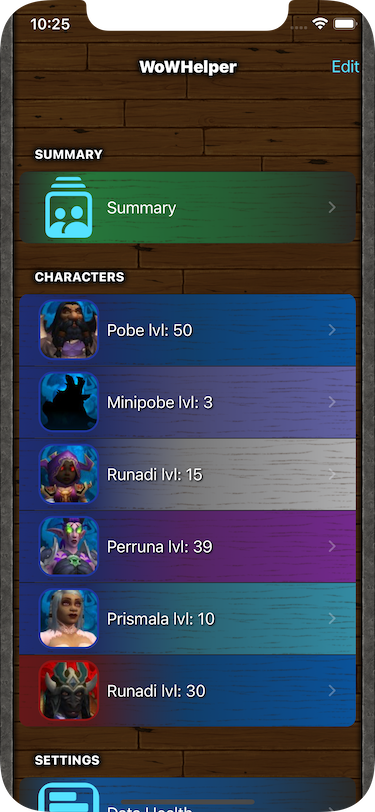

# WoW Helper
### Written in SwiftUI: iOS / iPadOS 14 required 
Utilities, Productivity, and Games
WoW Helper analyse your WoW profile to show you which raids to farm to get new mounts and pets. Additionally, it shows current week's progress in raiding for characters you select.  

**To use this app, you need to have a World of Warcraft account.**  

The test build is [available to test through Testflight](https://testflight.apple.com/join/AFrxUnTA), or [on Airport](https://app.airport.community/app/recE88RV4TTbtuEXC).  

Current features:  
* Suggesting raids based on mounts and pets still to obtain on account  
  * With three different sizes  
* Showing raid farming progress (bosses killed per raid) in current week  
  * Based on selected difficulty levels  
* Manually sorting characters
* Hiding older / not often used alts
* App works on iPhones and iPads

  

Roadmap:
* Homescreen Widget to show suggested raid (loaded from app)
  * Updating widget automatically without the need to open app
* Detail view for raid, with specified bosses and loot
* Setting ignored raids, no matter loot status
* Mac version